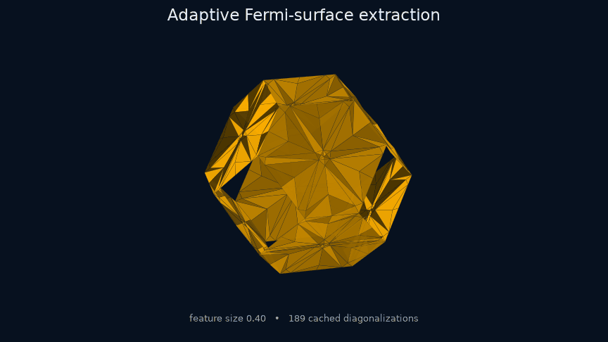
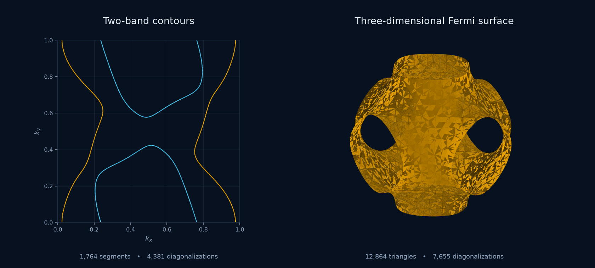

# fermisimplex

**Adaptive, occupation-certified spectral calculations on simplex meshes.**

fermisimplex finds Fermi surfaces and computes zero-temperature charge and
density matrices without paying for a dense momentum grid. Its central object
is the local occupation

$$
N(k; \mu) = \mathrm{Tr}\left[\Theta\left(\mu I - H(k)\right)\right],
$$

and its central question is simple: *can the occupation be proved constant on
this simplex, or should we look more closely?*



- 🛡️ **Occupation certificates** prove gapped simplices and rigorous charge
  bounds from vertex eigensystems and a user-supplied curvature bound.
- ⚡ **Adaptive sampling** concentrates diagonalizations near unresolved Fermi
  surfaces instead of refining the entire Brillouin zone uniformly.
- ♻️ **Shared spectral cache** lets Fermi-surface, charge, and density-matrix
  calculations reuse the same mesh and eigensystems.
- 🎯 **Projected charge estimates** inspect the nonlinear Hamiltonian residual
  only in the bands whose occupation is still ambiguous.
- 🧩 **Python and C++** share one numerical core; models can be dense callables
  or translation-invariant tight-binding Hamiltonians.

## Quick start

From a source checkout with a C++20 compiler and BLAS/LAPACK available:

```bash
pip install .
```

The model below produces the three-dimensional surface shown above:

```python
import numpy as np

from fermisimplex import Hamiltonian, SpectralMesh


def hamiltonian(kx, ky, kz):
    phase = 2 * np.pi * np.array([kx, ky, kz])
    return np.array([[np.cos(phase).sum()]], dtype=complex)


mesh = SpectralMesh(Hamiltonian(hamiltonian))
surface = mesh.fermi_surface(
    mu=0.17,
    min_feature_size=0.07,
    curvature_bound=(2 * np.pi) ** 2,
)

surface.points      # (npoints, 3)
surface.cells       # (ntriangles, 3)
surface.cell_bands  # band index for every triangle
```

The coordinates are reduced coordinates in $[0,1]^d$. Here
$M=(2\pi)^2$ bounds every directional second derivative of the scalar
Hamiltonian. `Hamiltonian` infers the momentum-space dimension from the
function arguments and the matrix dimension by evaluating it at the origin.
Both model types are evaluated with separate coordinates: `model(kx, ky, ...)`.



The same `SpectralMesh` can drive the other observables:

```python
from fermisimplex import AdaptiveOptions

options = AdaptiveOptions(target_error=1e-2, max_refinements=10_000)

charge = mesh.integrate_charge(
    mu=0.17,
    options=options,
    curvature_bound=(2 * np.pi) ** 2,
)
density = mesh.integrate_density_matrix(
    mu=0.17,
    lattice_vectors=[(0, 0, 0), (1, 0, 0)],
    options=options,
)

charge.value
charge.stopping_error
charge.certified_error_bound
density.matrices  # (number of lattice vectors, ndof, ndof)
```

For a tight-binding model,

$$
H(k)=\sum_R H_R e^{-2\pi i k\cdot R},
$$

use `TightBinding({R: H_R, ...})`. Opposite hoppings are checked for
$H_{-R}=H_R^\dagger$.

## What does the certificate prove?

The certificate is a local proof that the number of occupied states cannot
change anywhere inside a simplex. fermisimplex starts from the eigensystems at
the simplex vertices and searches for complementary trial subspaces on which
$H(k)-\mu I$ is strictly negative or strictly positive. A user-supplied
curvature bound limits how far the Hamiltonian inside the simplex can depart
from its vertex-linear interpolation. When the vertex margins dominate that
allowed departure, the sign separation—and therefore the occupation—holds
throughout the simplex without sampling its interior.

A successful proof means that no Fermi surface crosses the simplex. If only
part of the spectrum can be separated, the same argument still gives rigorous
lower and upper bounds on the occupation. If the proof is inconclusive,
fermisimplex makes no claim that the simplex is gapless; it refines the simplex
and tries again.

The charge and Fermi-surface routines apply this test to every simplex.
Remaining occupation uncertainty is accumulated in
`charge.certified_error_bound`. For surfaces, `surface.coverage_certified` says
that occupation classification succeeded down to `min_feature_size`; it does
not certify topology or geometric distance from the exact surface. Density
matrices currently use adaptive error estimates rather than a certificate.

The guarantee assumes that `curvature_bound` is valid. Omitting it, passing
`None`, or passing `0.0` asserts zero curvature; none of these choices disables
certification. The interpolation bound, proof, charge bound, and distinction
between certified and adaptive stopping errors are developed in the
[mathematics guide](docs/mathematics.md).

## API at a glance

- `Hamiltonian`: wrap a dense Python callable.
- `TightBinding`: evaluate a Hermitian hopping expansion.
- `SpectralMesh`: own adaptive geometry and cached eigensystems.
- `certify_simplex`: certify supplied vertex eigenpairs directly.
- `integrate_charge`: adaptive filling and $dQ/d\mu$.
- `integrate_density_matrix`: real-space density-matrix components.
- `fermi_surface`: band-labelled points and cells in reduced coordinates.

See the runnable [quick start](examples/quick_start.py) and
[two-band plotting example](examples/fermi_surface.py), the
[visual-generation notes](docs/visuals.md), and the
[build and architecture guide](docs/development.md).

## Development

```bash
pixi run test
```

This builds the standalone C++ library, verifies an installed downstream CMake
consumer, rebuilds the Python extension, and runs the Python tests. The dense
60-band stress case lives in [benchmarks/fermi_surface_60.py](benchmarks/fermi_surface_60.py).
