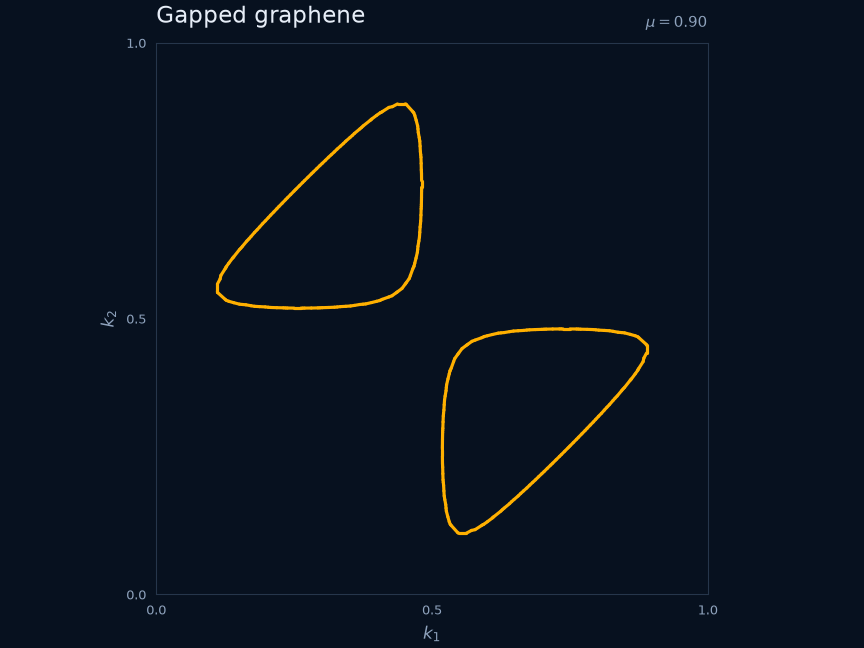
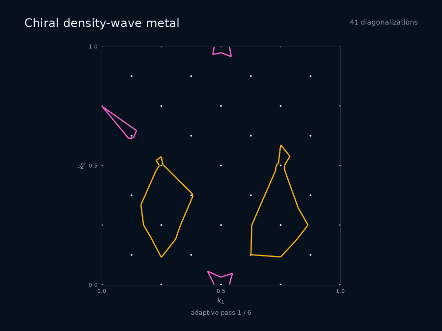
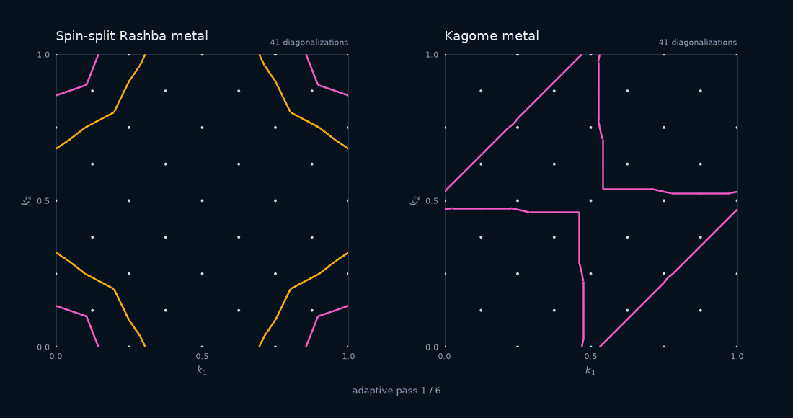
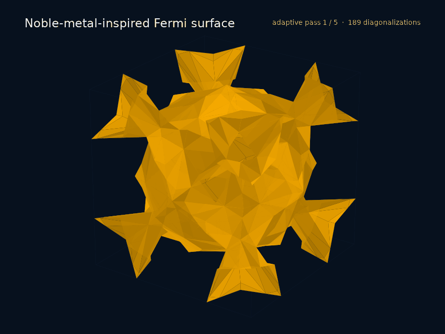

# FermiSimplex

> Adaptive spectral calculations that spend work where the physics can change.

FermiSimplex computes band-labelled Fermi surfaces for a Hermitian
Hamiltonian $H(k)$. Instead of filling the Brillouin zone with a uniform grid,
it subdivides momentum space into simplices and concentrates diagonalizations
around unresolved Fermi geometry.

The key shortcut is to remember what each diagonalization tells us. At every
evaluated vertex, FermiSimplex stores the Hamiltonian eigensystem and the
spectral information needed to bound nearby states. It combines these data
through rigorous matrix inequalities to determine whether the Fermi energy can
enter the spectrum anywhere inside a simplex. If the answer is no, the entire
region is proved gapped and needs no finer sampling. Only regions that might
contain a crossing are refined. The [mathematics guide][mathematics] gives
the precise inequalities.

## Why FermiSimplex?

- **Adaptive by construction.** Expensive eigensolves follow the Fermi surface
  instead of filling every quiet region of the Brillouin zone.
- **Mathematically certain classification.** Stored spectral data produce
  rigorous bounds on the spectrum throughout a simplex. A region is skipped
  only when those bounds exclude a Fermi-level crossing everywhere inside it.
- **Numerical efficiency is structural.** Adaptive refinement, cached
  eigensystems, and the compiled numerical core avoid repeated work as the
  Fermi surface becomes progressively sharper.
- **One mesh, several observables.** Fermi-surface extraction, charge, and
  density matrices can share the same adaptive work.
- **Multiband and multidimensional.** The same interface handles dense Hermitian
  models in one, two, and three momentum dimensions.
- **Python interface, compiled numerical core.** User-defined Python
  Hamiltonians drive the C++20 and BLAS/LAPACK implementation directly.

## Python in a minute

Install from a source checkout:

```bash
pip install .
```

Here is a compact gapped-graphene Hamiltonian. The callable signature tells
FermiSimplex that momentum space is two-dimensional.

```python
import numpy as np

from fermisimplex import SpectralMesh


def hamiltonian(k1: float, k2: float) -> np.ndarray:
    x, y = 2 * np.pi * np.array([k1, k2])
    hopping = 1 + np.exp(1j * x) + np.exp(1j * y)
    return np.array(
        [[0.18, -hopping], [-hopping.conjugate(), -0.18]],
        dtype=complex,
    )


mesh = SpectralMesh(hamiltonian)
surface = mesh.fermi_surface(
    mu=0.90,
    min_feature_size=0.025,
    curvature_bound=(2 * np.pi) ** 2,
)
```

In two dimensions, `surface.cells` contains pairs of endpoint indices. Plotting
is ordinary Matplotlib:

```python
from matplotlib import pyplot as plt
from matplotlib.collections import LineCollection

fig, ax = plt.subplots()
ax.add_collection(
    LineCollection(
        surface.points[surface.cells],
        colors="tab:orange",
        linewidths=1.5,
    )
)
ax.set(xlim=(0, 1), ylim=(0, 1), xlabel=r"$k_1$", ylabel=r"$k_2$")
ax.set_aspect("equal")
plt.show()
```



The returned NumPy arrays are ready for ordinary plotting and geometry tools:

```python
surface.points      # surface vertices in reduced coordinates
surface.cells       # line segments in 2D, triangles in 3D
surface.cell_bands  # eigenvalue-band identity of every cell
surface.stats       # evaluations, refinements, and classification counts
```

`min_feature_size` controls geometric resolution. `curvature_bound` is the
technical input used by the rigorous spectral-variation bounds; the
[mathematics guide][mathematics] explains how to obtain it.

## Adaptive sampling in practice

The dots below are actual Hamiltonian callback locations. They persist as the
same `SpectralMesh` is asked for successively finer surfaces. Each visual jump
is one completed public API call, and the animation loops after holding the
final result.

### Reconstructed two-band metal

Unequal electron pockets, boundary-crossing hole sheets, and a small pocket near
a Lifshitz transition make the refinement strongly nonuniform.



### Multiple bands and topologies

The identical workflow handles spin-split Rashba pockets and a three-orbital
Kagome metal. Surface color retains the eigenvalue-band identity returned in
`cell_bands`.



### Noble-metal-inspired surface in three dimensions

In three dimensions, the result is already a triangle mesh:

```python
triangles = surface.points[surface.cells]  # (ntriangles, 3, 3)
```



This compact fcc-like lattice harmonic is inspired by the broad belly and
narrow diagonal necks of copper and gold Fermi surfaces; it is an illustrative
model, not a fitted material calculation. Periodic necks join through the
Brillouin-zone boundary and leave the characteristic open face directions.
The animation first shows five completed adaptive resolutions, then rotates the
final 12,768-triangle mesh. It required 8,771 Hamiltonian diagonalizations and
no dense voxel grid.

For complete runnable examples, continue with
[`examples/quick_start.py`][quick-start] and
[`examples/fermi_surface.py`][fermi-example]. The
[development guide][development] describes the Python/C++ architecture.

## Reproduce the gallery

```bash
pixi run python -m docs.tools.generate_showcase_assets
```

The generator uses the public Python API and writes the presentation assets to
`docs/assets/`. To build the styled, self-contained local preview:

```bash
mkdir -p docs/generated
pandoc docs/showcase.md --standalone --embed-resources \
  --resource-path=docs --css docs/assets/showcase.css \
  --metadata title="FermiSimplex — visual tour" \
  -o docs/generated/showcase-preview.html
```


[mathematics]: https://github.com/Kostusas/FermiSimplex/blob/main/docs/mathematics.md
[quick-start]: https://github.com/Kostusas/FermiSimplex/blob/main/examples/quick_start.py
[fermi-example]: https://github.com/Kostusas/FermiSimplex/blob/main/examples/fermi_surface.py
[development]: https://github.com/Kostusas/FermiSimplex/blob/main/docs/development.md
